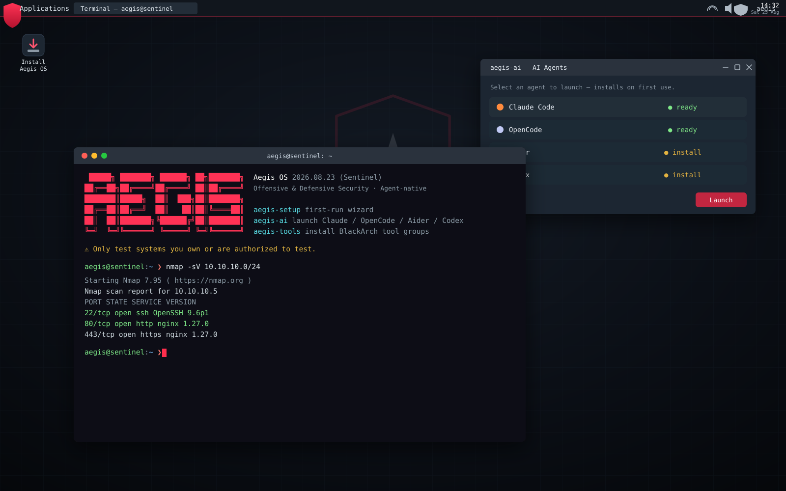
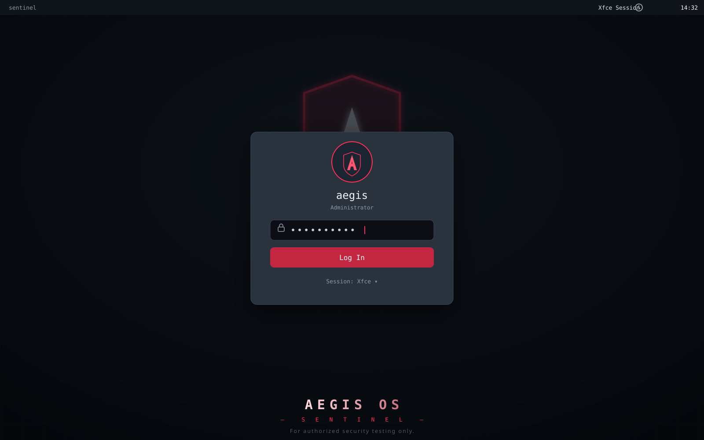

<div align="center">

# 🛡️ Aegis OS

**An Arch Linux–based, agent-native operating system for offensive & defensive security.**

*Codename: Sentinel*

Live + installable ISO · BlackArch arsenal · XFCE · Claude Code · OpenCode · Aider · Codex

<br>



<sub>XFCE 4 · adw-gtk3-dark + Papirus · the <code>aegis</code> MOTD banner · the <code>aegis-ai</code> launcher · a live <code>nmap -sV</code> scan</sub>

</div>

---

Aegis OS is a **real, bootable operating system** in the tradition of Kali Linux, BlackArch,
and Parrot OS — built on the rolling-release Arch base, preloaded with a large security
toolset via the **BlackArch** repositories, and — unlike any of them — shipping **AI coding
agents as first-class citizens** of the platform (Claude Code, OpenCode, Aider, and Codex),
wired together behind a single `aegis-ai` launcher and a first-boot setup wizard.

This repository is the **source of the distribution**. It contains an
[`archiso`](https://gitlab.archlinux.org/archlinux/archiso) profile, the custom packages,
the branding, and the build tooling that compile into a distributable `.iso`.

> ⚠️ **You are on Windows with no local Linux build environment.** Building an Arch ISO
> requires Linux. The **recommended path is GitHub Actions** (cloud build, zero local setup) —
> see [Quick start](#-quick-start). Local Docker and WSL2 paths are also provided.

---

## ✨ What's inside

| Layer | Details |
|-------|---------|
| **Base** | Arch Linux (rolling), current `linux` kernel, `mkinitcpio`-generated live image |
| **Tools** | BlackArch (2800+ tools) — **all major categories baked in** by default, the rest on demand via `aegis-tools`. Tune with `AEGIS_TOOL_SET` (`lean`/`broad`/`full`) |
| **Desktop** | XFCE 4, dark "Aegis" theme (adw-gtk3-dark + Papirus-Dark + Daloa decorations), Aegis wallpaper, branded top panel, a **10-category Aegis Tools menu**, an **Install Aegis OS** desktop icon, autologin live user |
| **AI agents** | Claude Code, OpenCode (native Arch pkg), Aider, Codex — unified `aegis-ai` launcher + `aegis-setup` wizard |
| **Runtimes** | Node.js 22, Python + `pipx` + `uv`, Go, Rust, Git, ripgrep — so agents & tools work out of the box |
| **Installer** | Calamares graphical installer — Aegis is **installable to disk**, not just a live CD |
| **Shell** | Zsh + a security-focused prompt, sensible aliases, tmux |

See [`docs/TOOLS.md`](docs/TOOLS.md) for the full toolset and [`docs/AI-AGENTS.md`](docs/AI-AGENTS.md)
for how the agents are integrated.

---

## 🖼️ Look & feel

### The greeter

<div align="center">



<sub>The LightDM greeter (adw-gtk3-dark): shield avatar, the <code>aegis</code> user, Xfce session.</sub>

</div>

### The desktop

The XFCE session is configured **statically**, via xfconf XML shipped in
[`etc/skel/.config/xfce4/`](profile/airootfs/etc/skel/.config/xfce4/). `useradd -m` copies
`/etc/skel` before the first login, so the config is already in place when `xfdesktop` and
`xfce4-panel` first read their channels — the Aegis desktop is what you see on the first frame,
with no flash of stock XFCE and no first-run "Default or Empty panel?" dialog.

| Piece | Ships as | What you get |
|-------|----------|--------------|
| **Top panel** | [`xfce4-panel.xml`](profile/airootfs/etc/skel/.config/xfce4/xfconf/xfce-perchannel-xml/xfce4-panel.xml) | Whisker "Aegis" menu button, launchers for Terminal / Files / Firefox / Aegis Tools / Aegis AI / Install, window buttons, workspace pager, tray, clock, session actions |
| **Aegis Tools menu** | [`aegis-tools.menu`](profile/airootfs/etc/xdg/menus/xfce-applications-merged/aegis-tools.menu) + 10 category files + 73 launchers | Kali-style numbered categories: Information Gathering → Anonymity & Maintenance |
| **Wallpaper** | [`xfce4-desktop.xml`](profile/airootfs/etc/skel/.config/xfce4/xfconf/xfce-perchannel-xml/xfce4-desktop.xml) | Sentinel wallpaper, seeded across every common monitor name |
| **Window borders** | [`xfwm4.xml`](profile/airootfs/etc/skel/.config/xfce4/xfconf/xfce-perchannel-xml/xfwm4.xml) | `Daloa` dark decorations, matching adw-gtk3-dark |
| **Terminal** | [`terminalrc`](profile/airootfs/etc/skel/.config/xfce4/terminal/terminalrc) | GitHub-dark palette, JetBrainsMono Nerd Font, red cursor |
| **Install icon** | [`etc/skel/Desktop/`](profile/airootfs/etc/skel/Desktop/) | **Install Aegis OS** on the desktop, marked trusted by `aegis-live-setup` so XFCE does not warn |
| **Brand icons** | [`hicolor/scalable/apps/`](profile/airootfs/usr/share/icons/hicolor/scalable/apps/) | 14 self-hosted SVGs — every `Icon=` in the profile resolves |

Every menu entry runs through
[`aegis-run`](profile/airootfs/usr/local/bin/aegis-run), which holds the terminal open on exit —
and, when the tool is not in this build's `AEGIS_TOOL_SET`, explains what it is and offers to
install it instead of failing silently. So the menu stays useful on a `lean` image.

### Wallpapers

Aegis ships **four** SVG wallpapers in `/usr/share/backgrounds/aegis/` (they render because
`librsvg` is installed); the red **Sentinel** design is the default for both the desktop and the
greeter ([`lightdm-gtk-greeter.conf`](profile/airootfs/etc/lightdm/lightdm-gtk-greeter.conf)):

| Wallpaper | File | Vibe |
|-----------|------|------|
| **Sentinel** (default) | `aegis-wallpaper.svg` | Red shield emblem, centered wordmark |
| **Matrix** | `aegis-wallpaper-matrix.svg` | Green, faint falling-code columns |
| **Blue Team** | `aegis-wallpaper-blueteam.svg` | Cyan defensive palette |
| **Minimal** | `aegis-wallpaper-minimal.svg` | Small lower-left emblem, lots of negative space |

Switch the desktop from **Settings → Desktop** (or edit the `last-image` values in
`xfce4-desktop.xml`); switch the greeter by editing `background =` in
`lightdm-gtk-greeter.conf`. Multi-head and hotplugged outputs that the static file cannot
predict are caught after login by
[`aegis-desktop-setup`](profile/airootfs/usr/local/bin/aegis-desktop-setup), which only fills in
monitors that are missing or wrong.

> The two images above are hand-drawn SVGs of the shipped design, rendered from the same colors,
> fonts, and layout the profile configures.

---

## 🚀 Quick start

### Option A — GitHub Actions (recommended, no local Linux needed)

1. Create a new GitHub repository and push this project to it:
   ```bash
   git init && git add . && git commit -m "Aegis OS initial"
   git branch -M main
   git remote add origin https://github.com/<you>/aegis-os.git
   git push -u origin main
   ```
2. In the repo, open the **Actions** tab and run the **Build Aegis OS ISO** workflow
   (it also runs automatically when you push a tag like `v2026.08.23` — but *not* on a
   plain push to `main`, so ordinary commits never burn a 40-minute build).
3. When it finishes (~20–40 min), download the ISO from the workflow **Artifacts**,
   or — if you pushed a tag — from the auto-created **Release**.

That's it. No Docker, no WSL, nothing installed locally.

### Option B — Local build with Docker Desktop

Install [Docker Desktop for Windows](https://www.docker.com/products/docker-desktop/), then:

```bash
bash scripts/build-docker.sh
```

The ISO lands in `out/`. (Runs an `archlinux` container that does the whole build.)

### Option C — Local build in WSL2 + Arch

```bash
bash scripts/setup-wsl.sh      # one-time: bootstrap an Arch environment in WSL2
# then, inside the Arch WSL shell, from the repo root:
sudo bash scripts/build-iso.sh
```

Full details, prerequisites, and troubleshooting are in [`docs/BUILDING.md`](docs/BUILDING.md).

---

## 💽 Booting / installing the ISO

- **Try it live:** write the ISO to a USB stick ([Rufus](https://rufus.ie/),
  [balenaEtcher](https://etcher.balena.io/), or `dd`) and boot it. Autologins to the
  `aegis` live user. **Login `aegis` / password `aegis`, and the same password for `root`** —
  see [Live credentials](#-live-credentials) to change them or to debug a login that fails.
- **Install to disk:** double-click **Install Aegis OS** on the desktop, or use the shield
  launcher in the panel (both run Calamares).
- **Find the tools:** the **Aegis** menu button in the panel → **Aegis Tools** → 10 numbered
  categories. Anything not baked into this build offers to install itself when you launch it.
- **First boot:** run `aegis-setup` (or it opens automatically) to install/authenticate
  the AI agents and pull tool groups.

---

## 🔑 Live credentials

The live medium ships with **`aegis` / `aegis`** for both the `aegis` user and `root`.

Nothing in the SquashFS contains a password — a pacstrapped `/etc/shadow` ships `root`
**locked**, and the profile overlay deliberately carries no `shadow`, `passwd`, or PAM files.
Every credential is created at boot by one small oneshot:

| Piece | Role |
|-------|------|
| [`aegis-credentials`](profile/airootfs/usr/local/bin/aegis-credentials) | Creates the live user, sets both passwords, adds `wheel` + `autologin`, writes passwordless sudo. The **only** thing in the image that produces a usable password. |
| [`aegis-credentials.service`](profile/airootfs/etc/systemd/system/aegis-credentials.service) | Ordered `Before=` the greeter, the ttys, and `aegis-live-setup`, with a hard 45 s cap. Does no network I/O, no `locale-gen`, no `systemctl start` — so it has nothing to block on. |
| `/etc/aegis/credentials.conf` | Generated from `aegis.conf` by `scripts/build-iso.sh` (mode `0600`), sourced by the script. Calamares deletes it during install. |

**To change them,** edit `AEGIS_LIVE_PASSWORD` / `AEGIS_ROOT_PASSWORD` in
[`aegis.conf`](aegis.conf) and rebuild — the build refuses to produce an ISO whose
credentials file does not parse back to those exact values, so a password that would have
locked you out fails the build instead of the boot. Any characters work; the file is written
with `printf %q`, so quotes, spaces, `$`, `&`, and backslashes all round-trip.

**If a login ever fails,** switch to a VT (`Ctrl`+`Alt`+`F2`) or open a terminal and read:

```bash
journalctl -u aegis-credentials
```

Every account is verified against `/etc/shadow` after being set and the result is logged, so
that output names the account that failed rather than leaving you guessing. Passwords on the
**installed** system are separate — Calamares sets them, and it removes the live credentials
file, the live sudoers drop-in, and both live oneshots on the way out.

---

## 🗂️ Repository layout

```
aegis.conf                 # ← single source of truth (name, version, user, repos)
build.sh                   # top-level build dispatcher (auto / docker / native)
scripts/                   # build-iso.sh, build-docker.sh, setup-wsl.sh, lib/
scripts/dev/               # check-profile.sh (static profile lint), menu/icon generators
docker/Dockerfile          # Arch build image for local Docker builds
.github/workflows/         # GitHub Actions ISO build + release
profile/                   # the archiso profile
  ├─ profiledef.sh         # ISO metadata & boot modes
  ├─ pacman.conf           # BUILD-time repos (core/extra/blackarch/local aegis)
  ├─ packages.x86_64       # everything installed into the image
  └─ airootfs/             # the live filesystem overlay (branding, services, scripts)
packages/                  # custom aegis-* packages (PKGBUILDs → local repo)
branding/                  # logos, wallpaper, plymouth splash
docs/                      # BUILDING, AI-AGENTS, TOOLS, ETHICS
```

**Before you spend two hours on a build,** lint the profile — it runs on Windows, needs no Arch,
no Docker and no root, and catches the failures that otherwise only surface after a boot
(malformed XML, `.desktop` files missing keys, `Icon=` names that resolve to nothing, scripts
with no `file_permissions` entry — which would silently ship non-executable):

```bash
bash scripts/dev/check-profile.sh
```

The Aegis Tools menu is generated: the tables at the top of
[`scripts/dev/gen-tools-menu.sh`](scripts/dev/gen-tools-menu.sh) are the single source of truth
for all 73 tool launchers and the 10 category files. Edit the tables, re-run it, then re-run the
linter. Its output is committed, so builds have no dependency on the generator.

---

## ⚖️ Authorized use only

Aegis OS is a security-testing platform. The tools it ships can cause real harm if
misused. **Only use them against systems you own or have explicit written authorization
to test.** See [`docs/ETHICS.md`](docs/ETHICS.md). Using this software, you accept full
responsibility for your actions and agree to comply with all applicable laws.

---

## 📄 License

Build tooling and Aegis-authored components: **GPL-3.0** (see [`LICENSE`](LICENSE)).
Bundled third-party tools and AI agents retain their own respective licenses.
